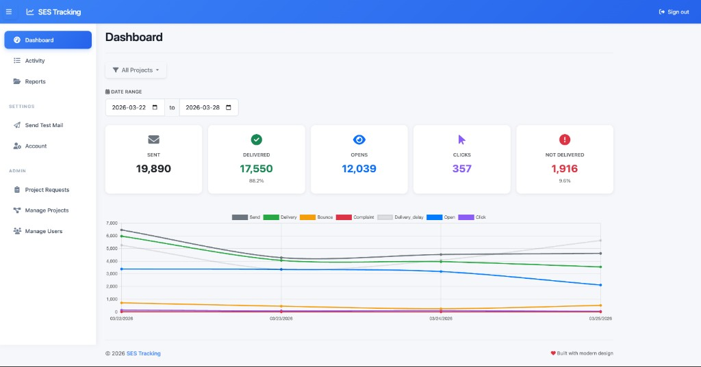

# SES Tracking — Self-hosted AWS SES email analytics dashboard

**SES Tracking** is a self-hosted **[Amazon SES](https://aws.amazon.com/ses/)** (Simple Email Service) analytics application built with **Laravel**. It ingests **SES event notifications** through **Amazon SNS** webhooks and turns them into dashboards, reports, and exports so you can monitor **email delivery**, **bounces**, **complaints**, **opens**, **clicks**, and related metrics across **teams and projects**.

**Website:** [sestracking.com](https://sestracking.com/)

## Who it is for

- Teams sending mail through **AWS SES** who want **private**, **self-hosted** visibility into the full event stream—not only sends, but **per-recipient** outcomes.
- Operators who need **multi-project** isolation (separate webhook URLs and access) and **multi-user** admin vs regular roles.
- Anyone migrating from or comparing to **[sesdashboard](https://github.com/Nikeev/sesdashboard)** and wanting a Laravel 11 stack, tests, optional **webhook payload logging**, and robust handling of edge cases (for example **open and click** attribution when one message has **multiple recipients**).

This project takes structural inspiration from [SES Dashboard](https://github.com/Nikeev/sesdashboard) (MIT, Copyright (c) 2020 Nikeev) but is maintained separately: different codebase, **Laravel 11**, automated tests, **built-in debug logging** for webhooks (toggle via env), **multi-user** and **multi-project** support, and corrected SES event handling for tricky real-world cases.

**License:** [MIT](LICENSE)

**Suggested GitHub topics:** `aws-ses`, `amazon-ses`, `sns`, `email-tracking`, `email-analytics`, `webhooks`, `laravel`, `php`, `self-hosted`, `transactional-email`, `dashboard`

## Features

- **Multi-user support:** Administrator and regular user roles
- **Multi-project management:** Dedicated **webhook endpoints** per project (`/webhook/{project_token}`)
- **Email event tracking:** Delivery, bounces, complaints, opens, clicks, delays (as surfaced by SES/SNS)
- **AWS integration:** **SNS → HTTPS** webhook processing with **idempotent** handling
- **Analytics dashboard:** **Chart.js** charts, filters by project and date range
- **Data export:** **CSV** and **Excel** with filters
- **Responsive UI:** **Bootstrap 5** frontend (including **Vue** components where used), compiled assets included in the repo

## Screenshots

### Dashboard

Overview of send, delivery, opens, clicks, and not-delivered metrics with project and date filters, plus a multi-series trend chart (send, delivery, bounce, complaint, delivery delay, open, click).



## Architecture

- **Backend:** Laravel 11, PHP 8.2+, MySQL 8
- **Frontend:** JavaScript with Bootstrap 5, Chart.js, and Vue (see `package.json` / Mix build for UI components)
- **Build:** Laravel Mix
- **Email provider:** Amazon SES
- **Ingest:** Amazon SNS notifications → Laravel webhook controllers (idempotent processing)

## Project Kickstart

### Prerequisites

- PHP 8.2+
- MySQL 8.0+
- Composer
- **Optional:** Node.js 18+ and npm/yarn (only if you change frontend sources and rebuild assets)

> **Note:** Compiled frontend assets are committed, so you do **not** need Node.js to run the app—only to develop or rebuild the asset bundle.

### Quick Start

1. **Clone and install dependencies:**
   ```bash
   git clone https://github.com/alephcom/sestracking.git
   cd sestracking
   composer install
   ```
   > No need to run `npm install` unless you are working on the frontend build.

2. **Environment configuration:**
   ```bash
   cp .env.example .env
   php artisan key:generate
   ```

3. **Database setup:**
   ```bash
   php artisan migrate
   php artisan db:seed
   ```

4. **Start the development server:**
   ```bash
   php artisan serve
   ```

### Frontend Development (Optional)

If you want to modify Vue components, styles, or rebuild frontend assets:

1. **Install Node.js dependencies:**
   ```bash
   npm install
   ```

2. **Build assets for development:**
   ```bash
   npm run dev
   ```

3. **Watch for changes (development):**
   ```bash
   npm run watch
   ```

4. **Build for production:**
   ```bash
   npm run prod
   ```

## Initial Data & Admin User

The database seeder creates an initial admin user:

- **Email:** `admin@example.com`
- **Password:** `password`
- **Role:** Administrator

This user has full access to all features including user management and project administration.

## Environment Configuration

Update the following parameters in your `.env` file:

### Database Configuration
```env
DB_CONNECTION=mysql
DB_HOST=127.0.0.1
DB_PORT=3306
DB_DATABASE=your_database_name
DB_USERNAME=your_username
DB_PASSWORD=your_password
```

### AWS SES Configuration (send test vs suppression list)

Laravel’s SES mail transport (send test) uses `AWS_ACCESS_KEY_ID`, `AWS_SECRET_ACCESS_KEY`, and `AWS_DEFAULT_REGION` in `.env` as usual.

**SES account-level suppression list** features (admin UI list/add/remove, webhook auto-push, and the scheduled daily import into `ses_suppressed_destinations`) use **only the per-project** Access Key ID, Secret Access Key, and region fields on each project in the admin UI. Global `.env` credentials are **not** used for those APIs.

Required **IAM actions** for suppression are listed on each project’s edit page and in `config/ses_suppression.php` (`ses:PutSuppressedDestination`, `ses:ListSuppressedDestinations`, `ses:DeleteSuppressedDestination`; `ses:GetSuppressedDestination` is available on the service for future use). Use `"Resource": "*"` in the policy unless your organization scopes further. The project’s AWS region must match the region where you send with SES for that account.

A queued job runs **daily** (see `routes/console.php`) to copy the account suppression list into `ses_suppressed_destinations` for **each project that has per-project SES keys and a resolvable region**. Ensure `php artisan schedule:run` is on your server crontab so the scheduler fires.

If your SES account already adds recipients to the account suppression list automatically for bounces or complaints, enabling auto-push in this app can be redundant but is otherwise safe.

```env
AWS_ACCESS_KEY_ID=your_aws_access_key
AWS_SECRET_ACCESS_KEY=your_aws_secret_key
AWS_DEFAULT_REGION=your_aws_region

MAIL_MAILER=ses
MAIL_FROM_ADDRESS=your_verified_email@domain.com
MAIL_FROM_NAME="${APP_NAME}"
```

### Application Settings
```env
APP_NAME="SES Tracking"
APP_ENV=local
APP_DEBUG=true
APP_URL=http://localhost:8000

```

### Optional: Webhook Debug Logging
```env
# Enable webhook payload logging for debugging (disable in production)
WEBHOOK_DEBUG_LOG=false
```

## Testing

Run the test suite:
```bash
vendor/bin/phpunit
```

## Two-factor authentication (email / password users)

Users who sign in with email and password (not Google/Microsoft SSO) must enroll an authenticator app (TOTP). Recovery codes are shown once after enrollment.

**Operator lockouts:** Clear 2FA for a user so they can enroll again on next sign-in:

```bash
php artisan user:reset-two-factor {user@email.com|user_id}
```

SSO-only users are rejected by that command (they do not use in-app TOTP).

**Application key rotation:** `two_factor_secret` is stored encrypted with your `APP_KEY`. If you run `php artisan key:generate` or change `APP_KEY` without decrypting existing data, existing TOTP secrets become unreadable. After a key rotation, affected users cannot sign in with TOTP until an operator runs `user:reset-two-factor` for each affected account (they set up a new authenticator on next login).

## Webhook Setup

Point **Amazon SES event publishing** at an **Amazon SNS** topic, then subscribe your app’s HTTPS endpoint to that topic. Each project exposes a unique path used as the **SNS HTTPS subscription URL** (confirm the subscription in SNS when prompted).

Configure **configuration sets** and event types (send, delivery, bounce, complaint, open, click, etc.) in the **SES console** so SES publishes notifications to SNS; SNS delivers JSON payloads to:

```
POST https://<your-domain.com>/webhook/{project_token}
```

Each project has a unique token for webhook authentication.

## TODO

- [ ] Add more detailed documentation for setting up AWS SES and SNS
